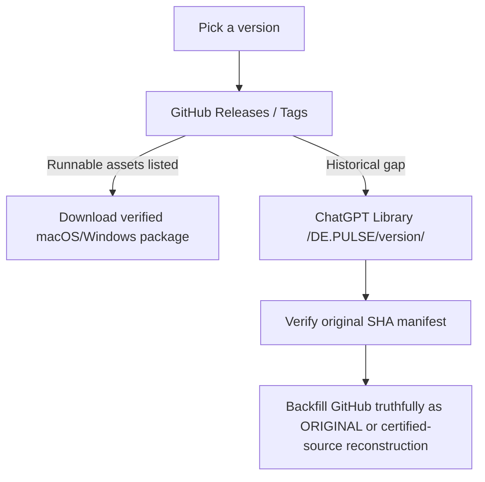

# DE.PULSE v18.5.0 TEST — Major Closure & Release Assurance

**Build:** `v18.5.0-test-major-closure-release-assurance-20260816`
**Channel:** TEST
**Current Stable baseline:** v18.4.0
**Major v18 provenance anchor:** v17.5.1
**Application bundle:** `De-Pulse-v18.5.0-TEST.app`
**Runtime/config:** `PersonalMarketTerminal-v18.5.0-TEST`

v18.5 is the mandatory v18 Major Closure before v19. It adds no unrelated product feature: it reconstructs and re-certifies the approved v18 system across architecture/source quality, data utility/correlation, security, adaptive governance, UI/UX, performance/capacity/stability, PostgreSQL/shared-state behavior, native runtime and release assurance. ADR-GDI/runtime overload is release-blocking when self-inflicted load can delay or misstate decision-critical evidence. Mature ASBI/TDTI/AODR/adaptive-13F work remains later roadmap scope.

### v18.5 release flow

### Where are the artifacts?

**Primary forward location:** GitHub repository `depulseapp/DE-PULSE` → **Releases** + immutable Stable tag.
**Repository evidence:** `release/<version>/`.
**Canonical archive map:** `governance/RELEASE_ARTIFACT_ARCHIVE.md`.
**Historical original fallback:** ChatGPT Library `/DE.PULSE/<version>/`; v16.8.0 through v16.11.0 contain original Stable runnable packages, and `/DE.PULSE/v17.5.1/DE-PULSE-v17.5.1-STABLE.zip` is the authoritative v17 Stable bundle.

## Previous Stable — v18.4.0 STABLE — Security / Commercial Readiness Hardening

**Build:** `v18.4.0-stable-security-commercial-readiness-20260816`
**Channel:** STABLE
**Current Stable baseline:** v18.3.0
**Major v18 provenance anchor:** v17.5.1
**Patch predecessor:** v18.3.0 STABLE
**Application bundle:** `De-Pulse.app`
**Runtime/config:** `PersonalMarketTerminal`

v18.4 STABLE hardens the existing secure multi-user/hosted platform without changing market-scoring formulas or provider routing authority. It adds fresh password re-authentication for high-impact mutations, hosted per-user request quotas with aggregate diagnostics, and explicit provider data-rights/commercial-readiness metadata. Commercial, redistribution and AI-use readiness remain fail-closed unless provider-specific evidence is bound; a working API key never implies legal/commercial approval.

Desktop remains SQLite/local by default and hosted PostgreSQL/shared-state behavior from v18.3 is preserved. Smart Provider Router v2 execution, protected deterministic Day/Swing/Long formulas and the permanent **No Execution Boundary** remain unchanged. The Stable desktop build uses canonical `PersonalMarketTerminal` and preserves compatible prior Stable state; the historical v18.4 TEST profile remains isolated. The promoted Stable identity is recertified from its exact source before final immutable tag/publication.

## Immediate Stable predecessor — v18.3.0 STABLE — PostgreSQL / Hosted Shared State

**Build:** `v18.3.0-stable-postgresql-hosted-shared-state-20260815`
**Channel:** STABLE
**Current Stable baseline:** v18.2.0
**Major v18 provenance anchor:** v17.5.1
**Patch predecessor:** v18.2.0 STABLE
**Application bundle:** `De-Pulse.app`
**Runtime/config:** `PersonalMarketTerminal`

v18.3.0 adds PostgreSQL repository parity beneath the existing storage-agnostic `PersistenceBackend`, bounded hosted DB pooling/transactions, shared-state observability, and an explicit hosted browser/server runtime with separate liveness and persistence-backed readiness. PostgreSQL is an explicit hosted selection and fails closed when unavailable; it never silently falls back to a local store.

Desktop macOS/Windows remain local-first and use the existing SQLite persistence path by default. Per-user watchlists/UI stay isolated while `processingStateLocked()` continues to form one deduplicated shared market-processing universe, so PostgreSQL does not multiply provider, scanner, Router, Rapid Move, Opportunity Radar or deterministic scoring work per user. Protected Day/Swing/Long formulas and the permanent **No Execution Boundary** remain unchanged. Backup/restore, SQLite→PostgreSQL migration/export, hosted contention/recovery, PostgreSQL 17 readiness, and final macOS Apple Silicon / Windows x64 runtime audits passed G0–G15 certification for this Stable promotion.

## Immediate Stable predecessor — v18.2.0 STABLE — Admin / Presence / Sessions

**Build:** `v18.2.0-stable-admin-presence-sessions-20260814`
**Channel:** STABLE
**Current Stable baseline:** v18.2.0
**Major v18 provenance anchor:** v17.5.1
**Patch predecessor:** v18.1.0 STABLE
**Application bundle:** `De-Pulse.app`
**Runtime/config:** `PersonalMarketTerminal`

v18.2.0 is the certified incoming Stable baseline. It extends the canonical `IdentityService` with role-aware user lifecycle operations, redacted user/session views, persisted-session presence truth, password reset/revocation lifecycle, SSE revocation enforcement, and privileged Settings administration while preserving v18.1 per-user isolation and shared intelligence.

## Previous Stable — v18.1.0 STABLE — Multi-User / My Market Symbols

**Build:** `v18.1.0-stable-multi-user-my-market-symbols-20260814`
**Channel:** STABLE
**Current Stable baseline:** v18.1.0
**Major v18 provenance anchor:** v17.5.1
**Application bundle:** `De-Pulse.app`
**Runtime/config:** `PersonalMarketTerminal`

v18.1.0 is the certified incoming Stable baseline for this promoted release. It provides durable per-user market workspaces while preserving one shared canonical market-data and intelligence core.

## Previous Stable — v18.0.6 STABLE — Smart Provider Router + Rapid Move / Market Shock Hardening

**Build:** `v18.0.6-stable-smart-provider-router-rapid-move-market-shock-hardening-20260814`
**Channel:** STABLE
**Current Stable baseline:** v18.0.5
**Major v18 provenance anchor:** v17.5.1
**Patch predecessor:** v18.0.5 STABLE
**Application bundle:** `De-Pulse.app`
**Runtime/config:** `PersonalMarketTerminal`

v18.0.6 is the promoted Stable hardening slice over certified v18.0.5 Stable. It reuses the existing Smart Provider Router v2 and Rapid Move canonical pipelines rather than creating parallel engines. The slice closes source-disagreement telemetry, explicit MARKET_SHOCK classification, alert-state hysteresis, durable provider-time outcome anchors, and SHADOW learning governance/outcome scorecards. Protected deterministic Day/Swing/Long formulas and the permanent **No Execution Boundary** remain unchanged. v18.1 multi-user architecture is explicitly out of scope.

## Previous Stable — v18.0.5 STABLE — UI/UX + Symbol Management Hardening

**Build:** `v18.0.5-stable-ui-ux-symbol-management-hardening-20260814`
**Channel:** STABLE
**Current Stable baseline:** v18.0.4
**Major v18 provenance anchor:** v17.5.1
**Previous Stable:** v18.0.4
**Application bundle:** `De-Pulse.app`
**Runtime/config:** `PersonalMarketTerminal`

v18.0.5 is the promoted Stable hardening patch over the certified v18.0.4 Stable source. It consolidates cross-desk Tracked Symbols mutations behind one canonical path, fixes Remove All persistence/rehydration behavior, refines Opportunity Radar and Research Target responsiveness, and hides implementation machinery from USER/DEMO surfaces while retaining privileged diagnostics. Protected deterministic Day/Swing/Long formulas, Smart Router/Rapid Move intelligence, and the permanent **No Execution Boundary** are unchanged. v18.1 multi-user architecture is explicitly out of scope.

## Previous Stable — v18.0.4 STABLE — Native Cross-Platform Closure

**Build:** `v18.0.4-stable-native-cross-platform-closure-20260813`
**Channel:** STABLE
**Previous Stable:** v17.5.1
**Application bundle:** `De-Pulse.app`
**Runtime/config:** `PersonalMarketTerminal`

v18.0.4 is the promoted Stable release of the fully certified v18.0.x foundation. It carries the Windows SQLite lifecycle and native G14 identity hardening that cleared macOS Apple Silicon, Windows x64, and G15 Release Assurance. Stable promotion changes release identity and the canonical Stable runtime target only; Smart Router v2, Rapid Move, provider logic, scoring, protected deterministic Day/Swing/Long formulas, and the permanent No Execution Boundary remain unchanged. v18.0.1 through v18.0.3 remain immutable historical TEST candidates.

## Previous v18.0.3 TEST — Native Cross-Platform Runtime Portability Hardening

**Build:** `v18.0.3-test-native-cross-platform-runtime-portability-hardening-20260813`
**Channel:** TEST
**Current Stable baseline:** v17.5.1
**Application bundle:** `De-Pulse-v18.0.3-TEST.app`
**Runtime/config:** `PersonalMarketTerminal-v18.0.3-TEST`

v18.0.3 is a release-blocker hardening patch discovered by native G14. It fixes Windows embedded-resource path normalization and makes real-Application tests isolate the OS-specific user-config location consistently across Linux, macOS and Windows. It also corrects Windows-only permission-test semantics and the native delivery harness. Smart Router v2, Rapid Move, provider logic, scoring, and protected deterministic Day/Swing/Long formulas remain unchanged. v18.0.2 remains an immutable failed native candidate and is not promoted.

## Inherited v18.0.1 Smart Router v2 + Rapid Move foundation

**Build:** `v18.0.1-test-smart-router-v2-rapid-move-foundation-20260813`
**Channel:** TEST
**Current Stable baseline:** v17.5.1
**Patch predecessor:** v18.0.0 TEST
**Application bundle:** `De-Pulse-v18.0.1-TEST.app`
**Runtime/config:** `PersonalMarketTerminal-v18.0.1-TEST`

v18.0.1 is the next isolated v18 TEST slice. It refactors the existing canonical Provider Router into Smart Intelligent Provider Router v2 foundations: provider×dataset×instrument×session capability/entitlement state, deterministic scoring, per-capability circuits, Preferred vs Serving truth, persistent NOT_ENTITLED cooldown/suppression, p50/p95 latency telemetry and provider-calls-avoided evidence. It does not create a second routing engine.

The same slice adds the Rapid Move / Market Shock intelligence foundation to the canonical live quote pipeline. Short-window 15s/30s/60s/2m/5m movement is context-normalized, validated against liquidity/source agreement/mechanical corporate-action risk, correlated with catalyst/news/SEC/earnings and SPY/QQQ context, promoted into Opportunity Radar/live priority when material, surfaced immediately through the header/Smart Notifications, and persisted only as meaningful evidence/decision/outcome learning state. The strong +5%/60s condition is a baseline trigger, not the sole rule.

**Coverage Truth:** short-window detection is exact only for symbols currently receiving canonical live/current observations. Opportunity Radar/market-activity evidence can seed promotion, but v18.0.1 does **not** claim full U.S.-market 15s/30s/60s surveillance without an entitled broad event feed.

Adaptive behavior remains governed by **SHADOW → VALIDATED → APPROVED → PRODUCTION**. Deterministic Day/Swing/Long Score/Action formulas and the permanent **No Execution Boundary** are unchanged.

## Previous v18.0.0 TEST — Identity & Secure Session Foundation

**Build:** `v18.0.0-test-identity-session-foundation-20260813`
**Channel:** TEST
**Current Stable baseline:** v17.5.1
**Previous Stable:** v17.5.1
**Application bundle:** `De-Pulse-v18-TEST.app`
**Runtime/config:** `PersonalMarketTerminal-v18-TEST`

v18.0.0 is the first v18 security slice. It adds the canonical role/principal model, persistent local identities and server-side sessions, Argon2id credentials, login/logout, centralized authorization/RBAC foundations, bootstrap OWNER migration, session rotation/revocation with idle/absolute expiry, CSRF protection, and a separate TEST profile that clones compatible v17.5.1 settings/watchlists/API keys/persisted intelligence without mutating Stable.

The deterministic Day/Swing/Long Score/Action formulas, Provider Router authority, U.S.-equities processing boundary and permanent No Execution Boundary are unchanged. v18.1 multi-user market symbols, Smart Intelligent Provider Router v2, TradeInsight SHADOW intelligence, v18.2 admin/presence, v18.3 PostgreSQL hosting and v18.4 broader security/commercial hardening remain later workstreams.

## Authoritative v17 Stable baseline

**v18.0.6 Stable** is now the authoritative Stable line. It upgrades the canonical `PersonalMarketTerminal` profile in place, preserving compatible settings, watchlists, API keys, identity state, and persisted intelligence from v17.5.1. The complete v17 and v18.0 TEST delivery history remains preserved in bundled documentation and QA evidence.

# DE.PULSE v16.11.0 — v16 Major Closure & Release Assurance

**Build:** `v16.11.0-stable-v16-major-closure-release-assurance-20260812`
**Channel:** STABLE
**Current Stable baseline:** v16.11.0
**Previous Stable:** v16.10.0
**Original professional roadmap:** **30 FULL / 0 PARTIAL / 0 MISSING** — freshly revalidated from current source
**v16.10 Opportunity & Decision Intelligence:** **10/10 preserved**

v16.11.0 is the mandatory **Major Closure & Release Assurance** build before DE.PULSE can enter v17. It intentionally adds no unrelated product feature. It reconstructs the complete v16 family from current code, freshly exercises v16.1 through v16.10, performs broad production/regression/performance testing, runs independent senior-engineer and professional trader/investor reviews, reconciles data/source hygiene and adaptive-process lessons, and issues the v16 → v17 Go/No-Go decision.

## Closure result and real-money hardening

- **Major Closure Scope Matrix:** all 30 original professional capabilities, 12 later v16 milestones and permanent architecture/safety contracts are mapped to current code owners and fresh executable evidence.
- **Fresh v16 family verification:** v16.1/1.1, v16.2, v16.3, v16.4, v16.5, v16.6, v16.7, v16.8, v16.8.1, v16.9 and v16.10 scope gates are rerun against the final closure candidate rather than accepted from historical reports.
- **Real-money safety fix:** a regular-session current-price quote that is `STALE`, `CACHED` or `HISTORY ONLY` can no longer leave Day Trade Readiness looking clean/`READY`. Day becomes `INCOMPLETE`; Swing/Long become `CONDITIONAL`. A `LAST TRADE` Day context requires live-session confirmation. Protected deterministic Day/Swing/Long Score/Action formulas remain unchanged.
- **Senior Developer / Principal Engineer review:** source ownership, maintainability, complexity, concurrency, error/failure handling, provider efficiency, performance, security, upgrade safety and developer-proof clarity are reviewed as a 15+ year production engineer would review them.
- **Professional Trader / Investor review:** freshness/degradation, liquidity, macro/event risk, community evidence, Opportunity Radar, replay/no-lookahead and false-confidence cases are evaluated as real-money decision support.
- **Performance/long-run:** bounded Radar promotion state, rotating-universe sampling, adaptive cadence, cache/concurrency/goroutine protections and representative performance benchmarks are revalidated before the v17 transition.
- **Data Utility / Source Hygiene:** active datasets require owners/consumers or explicit retention reasons; obsolete release debris is removed; retained assets are registered with purpose/consumers.

## Permanent Major Closure rule

Before every major-family transition (for example v16 → v17, v17 → v18), DE.PULSE must run a dedicated **Major Closure & Release Assurance** build. Prior audit reports are evidence inputs only; they cannot replace current-source inspection and fresh execution. A major transition is authorized only after the scope matrix, full blocking test campaign, expert engineering review, professional trader/investor review, performance/capacity/stability review, adaptive retrospective, documentation/provenance reconciliation and final Go/No-Go are complete.

## Permanent product and engineering contracts

- **U.S. equities only:** actionable per-symbol processing is U.S.-listed securities; global markets/macros remain selective U.S.-market context.
- **No execution:** no paper trading, simulated brokerage, Portfolio/P&L, Journal, OMS, broker order routing or autonomous/semi-autonomous execution.
- **Deterministic protection:** deterministic Day/Swing/Long formulas remain unchanged; AI/context/safety overlays cannot silently mutate or rewrite protected score/action truth. **Setup Score is not win probability.**
- **Provider Router authority:** one executable provider owner; no per-tab duplicate data engines.
- **Data Utility:** fetched/computed/stored data needs an active consumer or an explicit bounded strategic retention reason.
- **Adaptive Build Process v2:** G0–G16, Pre-Freeze Qualification, canonical release identity, resource-class-aware CI/CD, fingerprint-scoped checkpoints, single-owner RC, unique evidence reuse, clean extraction and SHA manifest generated last.
- **Shadow:** `SHADOW → VALIDATED → APPROVED → PRODUCTION`; Shadow cannot mutate production.
- **Application continuity:** `De-Pulse.app` uses `PersonalMarketTerminal`; compatible prior Stable settings, watchlists and API credentials are preserved.

## Adaptive roadmap after v16 closure

- **v17 — Persistent Intelligence Foundation:** repository abstraction, bundled SQLite, PostgreSQL-ready interfaces, Global Symbol Registry, structured persistent evidence/outcomes, Decision Lineage/Reproducibility, derived features, incremental sync, background/overnight processing, observability and one canonical pipeline per unique symbol.
- **v17 Major Closure:** mandatory before v18.
- **v18 — Secure Multi-User:** authentication/RBAC, sessions, configurable weekend forced sign-out/maintenance boundary, online-user presence, My Market Symbols vs Global Symbol Registry and configurable default 25 unique actionable symbols/user.
- **v19 — Professional Data Infrastructure:** provider capability/entitlement/latency/cost/coverage/reliability, higher-quality data only for proven gaps, commercial/data-rights readiness.
- **v20 — Adaptive Intelligence & Decision Research:** validated historical learning, analogs/calibration, pattern/regime outcomes, source reliability, drift/contradiction analysis and governed model evaluation.

The north star remains: **collect the best lawful evidence → understand it → preserve useful structured evidence → measure outcomes → learn through validated methods → improve U.S.-market decision support without becoming an execution platform.**

### v18.3 STABLE persistence backup / migration operations

- `DEPULSE_PERSISTENCE_EXPORT_PATH=/private/path/depulse-backup.json` writes a versioned SHA-256-verified canonical persistence archive during startup after identity/workspace initialization.
- `DEPULSE_PERSISTENCE_RESTORE_PATH=/private/path/depulse-backup.json` restores an archive after repository migrations and before IdentityService bootstrap.
- Restore defaults to empty-target-only. `DEPULSE_PERSISTENCE_RESTORE_MODE=replace` explicitly replaces existing persisted canonical state.
- Archives include identity password/session hashes and must remain private; provider/API secrets are not included.
- Hosted `/api/health` is process liveness; `/api/ready` is canonical persistence + identity readiness and returns 503 during database degradation/recovery.
