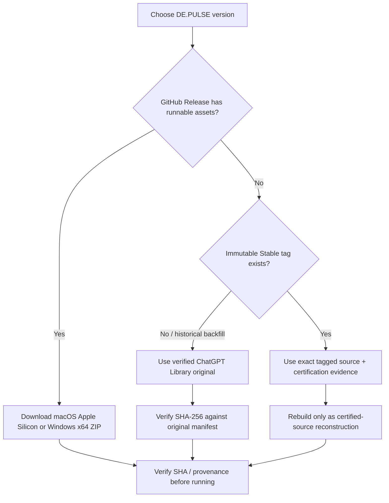
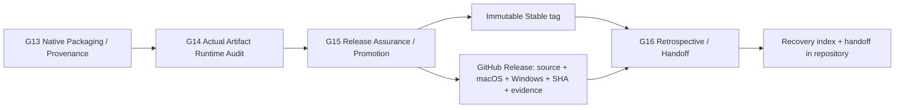

# DE.PULSE — Release Artifact Archive & Recovery

**Policy status:** PERMANENT from v18.5 Major Closure onward
**Primary durable recovery point:** GitHub Stable tag + GitHub Release assets
**Repository evidence:** `release/<version>/`
**Historical fallback/source of truth during backfill:** ChatGPT Library `/DE.PULSE/<version>/`

This policy is implemented inside existing G13/G14/G15/G16 responsibilities. It does **not** add a new top-level gate.

## Where do I get a build?

## Release storage model

## Canonical locations

| Release family | Artifact status | Canonical / recovery location |
|---|---|---|
| v16.8.0 Stable | Original runnable artifacts preserved | ChatGPT Library `/DE.PULSE/v16.8.0/` |
| v16.8.1 Stable | Original runnable artifacts preserved | ChatGPT Library `/DE.PULSE/v16.8.1/` |
| v16.9.0 Stable | Original runnable artifacts preserved | ChatGPT Library `/DE.PULSE/v16.9.0/` |
| v16.10.0 Stable | Original runnable artifacts preserved | ChatGPT Library `/DE.PULSE/v16.10.0/` |
| v16.11.0 Stable | Original runnable artifacts + source + installer + final SHA + provenance preserved | ChatGPT Library `/DE.PULSE/v16.11.0/` |
| v17.0.0 TEST | TEST source snapshot only | ChatGPT Library `/DE.PULSE/v17.0.0/` |
| v17.1.0 TEST | TEST source snapshot only | ChatGPT Library `/DE.PULSE/v17.1.0/` |
| v17.5.1 Stable | Authoritative complete Stable bundle preserved | ChatGPT Library `/DE.PULSE/v17.5.1/DE-PULSE-v17.5.1-STABLE.zip` |
| v18 Stable lineage | Immutable Stable tags exist in GitHub; Release-asset coverage is being normalized/backfilled | GitHub repository `depulseapp/DE-PULSE` → **Releases** and **Tags** |
| v18.1.0 Stable | GitHub Release assets confirmed: macOS Apple Silicon, Windows x64, source, SHA and G12/G14 evidence | GitHub Release tag `v18.1.0-stable` |
| v18.5.0 Stable (when promoted) | MUST contain complete runnable/recovery set | GitHub Release tag `v18.5.0-stable` + repository `release/v18.5.0/` |

### Historical v16.11 originals

The Library copy is cryptographically authoritative for backfill. Key files include:

- `/DE.PULSE/v16.11.0/De-Pulse-v16.11.0-Stable-macOS.zip`
- `/DE.PULSE/v16.11.0/De-Pulse-v16.11.0-Stable-Windows-x64.zip`
- `/DE.PULSE/v16.11.0/De-Pulse-v16.11.0-Stable-Source.zip`
- `/DE.PULSE/v16.11.0/De-Pulse-v16.11.0-Stable-SHA256.txt`
- `/DE.PULSE/v16.11.0/De-Pulse-v16.11.0-Authoritative-Release-Index.json`
- `/DE.PULSE/v16.11.0/DE-PULSE-v16.11.0-Authoritative-Major-Closure-Handoff-Adaptive-Roadmap-v17-BuildPlan.md`

### Historical v17.5.1 original

- `/DE.PULSE/v17.5.1/DE-PULSE-v17.5.1-STABLE.zip`

The v17.5.1 bundle contains the source ZIP, macOS ZIP, Windows ZIP, installer, QA/provenance/handoff and final SHA manifest.

## Truth labels for archived artifacts

Every archived item must be one of:

- **ORIGINAL** — exact historical artifact whose SHA matches the frozen manifest.
- **CERTIFIED-SOURCE RECONSTRUCTION** — rebuilt later from an exact certified source snapshot/tag; never described as the original binary.
- **TAG-ONLY** — immutable source identity exists but runnable assets have not yet been backfilled.
- **TEST-SOURCE** — historical TEST source snapshot, not a Stable runnable release.

## Required Stable GitHub Release contents

Starting with v18.5 Stable, G15/G16 must leave a durable GitHub Release containing, where applicable:

1. macOS Apple Silicon runnable ZIP;
2. Windows x64 runnable ZIP;
3. exact source ZIP;
4. SHA-256 manifest / per-artifact SHA files;
5. build provenance and authoritative release index;
6. G12/G14/G15 certification evidence;
7. final handoff / recovery instructions.

A tag alone is not sufficient to claim binary archival. A Release page must actually list the runnable assets before documentation says they are stored in GitHub.
